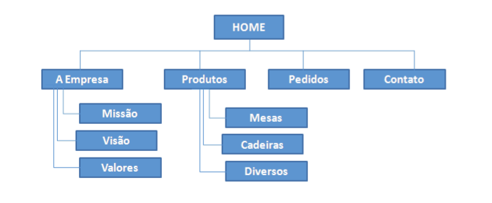
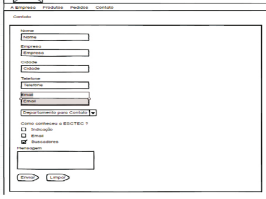

# ESTEC

## Mapa do Site

## As paginas devem seguir os requisitos abaixo:
 - ✅  Cabeçalho padrão para todas as páginas.
 - ✅  O Cabeçalho deve ter um logotipo.
 - ✅ Rodapé padrão para todas as páginas.
 - ✅ Título da Página.

 ## Criar as páginas: Produtos, Mesas, Cadeiras e Diversos seguindo os padrões das páginas criadas na Etapa anterior.
As páginas devem atender os seguintes requisitos:
 - ✅ Página Produtos: deve conter seis imagens de produtos que são considerados “lançamentos” pela ESTEC Brasil.
- ✅ Página Mesas: deve conter pelo menos 6 imagens.
- ✅ Página Cadeiras: deve conter pelo menos 6 imagens.
- ✅ Página Diversos: deve conter pelo menos 6 imagens de produtos como armários, quadros, estantes e etc.

## Criar os formulários das páginas Pedidos e Contato. As páginas devem atender os requisitos a seguir:
 
### Pagina Contato:
- ✅ Campos do Formulário: Campo de texto: Nome, Empresa, Cidade, Telefone, Email.
- ✅ Caixa de seleção (combo box, select ): Departamento para Contato.
- ✅ Botões de seleção (radio button ): Como conheceu a ESTEC ?
- ✅ Área de Texto (text area): Mensagem.

### Pagina Pedido:
- ✅ Campos do Formulário:
- ✅ Campo de texto: Nome Vendedor, Empresa, CNPJ, Endereço, Cidade, UF
Telefone, Email, Itens de Produto (descrição de produtos, qtde, valor unitário, valor
total por item) onde o pedido deve aceitar no máximo 5 produtos e valor total do
pedido.
- ✅ Caixa de seleção (combo box, select ): Vendedor (criar pelo menos 5
vendedores), Produto (utilizar os mesmos produtos das paginas produtos, cadeiras,
mesas e diversos).
- ✅ Botões de seleção (radio button): Como conheceu a ESTEC ?
- ✅ Área de Texto (text área): Mensagem.

### Java Script:
- ✅ Mensagem de “Bom dia”, “Boa tarde” ou “Boa Noite” de acordo com o horário que a página è visitada.
- ✅ Criar em Java Script uma função que verifica se o CNPJ informado por parâmetro é
válido.
- ✅ Criar em Java Script uma função para verificar se um email informado por parâmetro é válido.
- ✅Criar em Java Script uma função para verificar se um texto informado possui menos que três letras, caso for verdadeiro exibir uma mensagem (alert) informando que o texto é inválido.
    - 📄 Página "Contato"
        - Nome
        - Empresa
        - Cidade

    - 📄 Página "Pedido"
        - Nome Vendedor
        - Empresa
        - Cidade
        - Endereço
        - Itens de Produto (descrição)